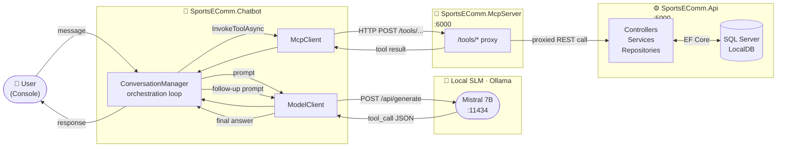

# Sports eCommerce GenAI Showcase 🏏

A .NET 10 demo that shows how a **Small Language Model (SLM)** running entirely on your local machine can drive a real shopping experience — browsing products, managing a cart, and placing orders — entirely through natural language.

> **What is an SLM?**  
> A Small Language Model is a compact AI model (typically ≤ 13 B parameters) that runs efficiently on a laptop or workstation without cloud APIs, GPU clusters, or internet access. This demo uses **Mistral 7B** (7 B parameters) served locally via **Ollama** — the same pattern that works for on-premise, air-gapped, or privacy-sensitive deployments.

---

## How it fits together



---

## Status

| Component | Status |
|-----------|--------|
| `SportsEComm.Api` | ✅ Complete — products, auth, cart, orders |
| `SportsEComm.McpServer` | ✅ Complete — full tool proxy over HTTP |
| `SportsEComm.Chatbot` | ✅ Complete — SLM orchestration with Mistral 7B (Ollama) |

---

## Repository layout

```
SportsEComm-GenAI/
├── SportsEComm.Api/            # .NET 10 Web API (EF Core, JWT)
├── SportsEComm.McpServer/      # MCP-style HTTP tool proxy
├── SportsEComm.Chatbot/
│   ├── SportsEComm.Chatbot.Common/   # ModelClient, McpClient, ConversationManager
│   └── SportsEComm.Chatbot.Console/  # Entry point (console UI)
├── docs/
│   ├── architecture.md         # System design & component diagrams
│   ├── api-reference.md        # All REST & MCP endpoints
│   ├── chatbot.md              # Chatbot internals & conversation flow
│   └── seed-data.md            # Demo customers & product catalog
├── SportsEComm-GenAI.slnx
└── README.md
```

---

## Quick start

**Prerequisites**
- .NET 10 SDK
- SQL Server LocalDB
- [Ollama](https://ollama.com) with `mistral:7b` pulled

```bash
# 1 — start the backend API
dotnet run --project SportsEComm.Api --urls "http://localhost:5000"

# 2 — start the MCP tool proxy
dotnet run --project SportsEComm.McpServer --urls "http://localhost:6000"

# 3 — run the chatbot
dotnet run --project SportsEComm.Chatbot/SportsEComm.Chatbot.Console
```

> The API auto-creates and seeds the database on first run. No migrations needed.

---

## Try it

Once all three services are running, type a message in the console:

```
You: show me cricket bats
You: /login ms.dhoni@teamindia2011.com dhoni7#cup
You: add the MSD bat to my cart
You: place my order
You: /exit
```

See [docs/seed-data.md](docs/seed-data.md) for all demo login credentials.

---

## Docs

| Document | What's inside |
|----------|---------------|
| [architecture.md](docs/architecture.md) | Components, data flow, design decisions |
| [api-reference.md](docs/api-reference.md) | Every REST and MCP endpoint |
| [chatbot.md](docs/chatbot.md) | How the chatbot orchestrates SLM + MCP |
| [seed-data.md](docs/seed-data.md) | Demo customers and product catalog |
