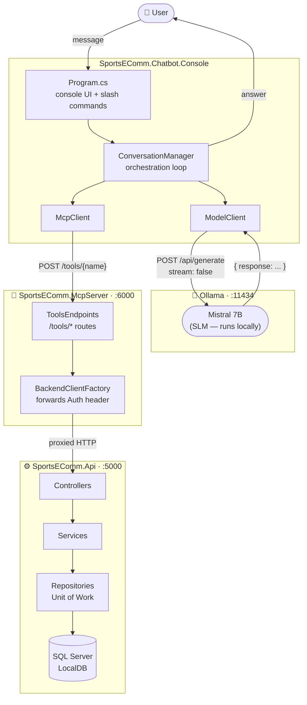
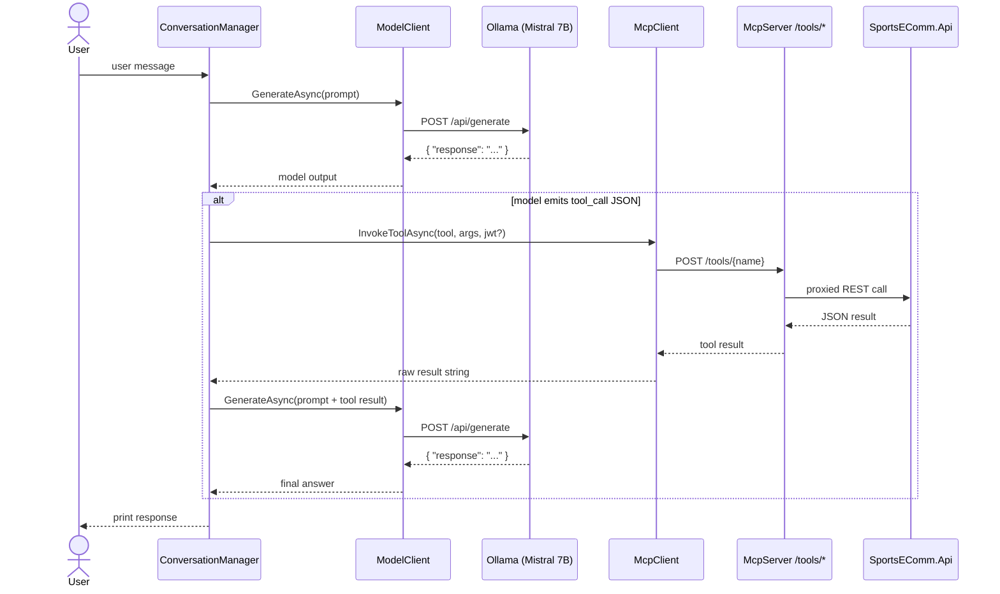
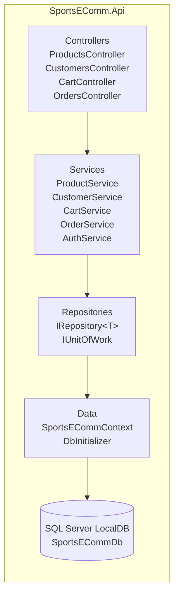

# Architecture

The system is a three-tier pipeline where a **Small Language Model (SLM)** running locally orchestrates shopping actions through a controlled tool proxy, which in turn calls a real backend API.

> **SLM choice**: Mistral 7B (7 B parameters) via Ollama. Small enough to run on a laptop CPU/GPU, capable enough to understand intent and emit structured tool-call JSON.

---

## System overview

---

## Chatbot orchestration loop

Each user message goes through up to two model calls — one to determine intent (and possibly emit a tool call) and a second to compose the final answer from the tool result.

---

## API layer structure

---

## Components

### SportsEComm.Api
- **Framework**: .NET 10 Web API with MVC controllers
- **Database**: SQL Server LocalDB via Entity Framework Core 10
- **Auth**: JWT Bearer — identity resolved from claims, never from URL params
- **Patterns**: Repository + Unit of Work, service layer, DTOs, `PasswordHasher<T>` for secrets

### SportsEComm.McpServer
- **Framework**: .NET 10 minimal API — HTTP only
- **Role**: tool proxy; maps `/tools/*` routes to backend API calls, forwards `Authorization` headers
- **Config**: `BackendApi:Url` in `appsettings.json` (default `http://localhost:5000`) or env var `BACKEND_API_URL`

### SportsEComm.Chatbot.Common
- **`ModelClient`** — posts to Ollama `/api/generate` (`stream: false`), reads `response` field
- **`McpClient`** — HTTP client for MCP tool endpoints; attaches JWT when provided
- **`ConversationManager`** — orchestration loop: prompt → detect `tool_call` JSON → MCP → second prompt → answer
- **`PromptTemplates`** — builds system + user prompts and tool-result follow-up prompts

### SportsEComm.Chatbot.Console
- Entry point; reads `appsettings.json` for `Model:Endpoint`, `Model:Name`, `MCP:BaseUrl`, `SystemPrompt`
- Handles `/login <email> <secret>` and `/exit` slash commands
- Delegates all other messages to `ConversationManager`

---

## Design decisions

| Decision | Rationale |
|----------|-----------|
| HTTP-only for local demo | Avoids dev-cert issues; `UseHttpsRedirection` is commented out but preserved |
| JWT identity from token claims | Customer ID is never trusted from URL parameters — extracted from `HttpContext.User` |
| `ReferenceHandler.IgnoreCycles` | EF navigation properties create circular refs (`Cart → CartItem → Cart`); ignored at serialization |
| `stream: false` on Ollama | Simplifies parsing; full text arrives in a single JSON object |

---

## Ports

| Service | Default URL |
|---------|------------|
| SportsEComm.Api | `http://localhost:5000` |
| SportsEComm.McpServer | `http://localhost:6000` |
| Ollama | `http://localhost:11434` |
